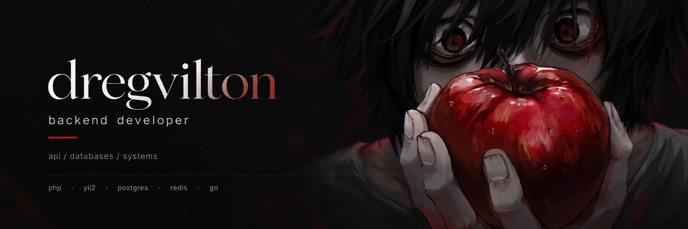

<p align="center">
  
</p>

<br>


## about

Backend developer working with **APIs, databases and production systems**.

Main stack: **PHP / Yii2 / PostgreSQL / Redis**.  
Also using **ClickHouse, Docker, Nginx, Go and Python**.

<br clear="right"/>

## stack

<table>
  <tr>
    <td><b>backend</b></td>
    <td>PHP · Yii2 · Go · Python</td>
  </tr>
  <tr>
    <td><b>databases</b></td>
    <td>PostgreSQL · ClickHouse · MySQL · Oracle</td>
  </tr>
  <tr>
    <td><b>infrastructure</b></td>
    <td>Redis · Docker · Nginx · Linux</td>
  </tr>
</table>

<br>

## currently

```text
backend systems / architecture / go
```

<br>

## contact

[telegram](https://t.me/kvashnin_dev)

<br>

<p align="center">
  <sub>code / systems / ideas</sub>
</p>
